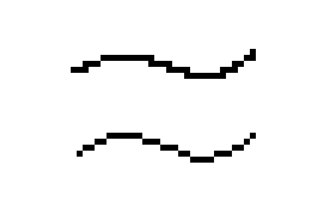

# pixelapp
[Play](https://crowswalk.github.io/pixelapp/)
#### A pixel-art drawing program prototyped in [p5](https://p5js.org/), a Javascript framework for interactive visual experiences.
#### The minimal interface is inspired by [Aseprite](https://www.aseprite.org/) and [Flipnote Hatena](https://en.wikipedia.org/wiki/Flipnote_Studio). My intention is to design a UI that works well with the drawing workflow using an Apple Pencil on iPad.

Preliminary wireframe sketch
